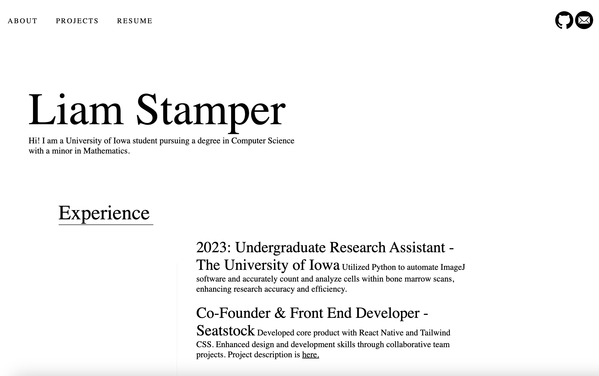

# William (Liam) Stamper's Portfolio

## Live site: [liamstamper.com](https://liamstamper.com)
Welcome to my professional portfolio on GitHub! Here, you will find the culmination of my work as a Computer Science student at the University of Iowa, my projects, and the experiences that have shaped my journey as a developer.  

## Education

**The University of Iowa, Iowa City, IA**  
_Bachelor's Degree in Computer Science, Minor in Mathematics_  
*August 2021 – Anticipated December 2024*

### Coursework
- Data Structures
- Discrete Structures
- Calculus I-III
- Matrix Algebra
- Computer Science I-II
- Algorithms (in-progress)
- Software Development (in-progress)

### Extracurricular Activities
- Association for Computing Machinery (ACM)
- UIowaHackathon 2023 Award Winner
- Spanish Club Member

## Experience

### Full Stack Developer Internship
_Quality Manufacturing, West Des Moines, IA (May 2022 – August 2022)_
- Developed over 5 dynamic form applications.
- Participated in an intensive web development training program.
- Collaborated within a team of 5, serving over 10 clients.

## Projects

### SeatStock
_August 2023 – November 2023_
- Seatstock - A platform simplifying the exchange of student tickets.
- Lead Frontend Developer using React.js and Tailwind CSS.

### COVID-19 Data Visualizer
_November 2023 - Present_
- An application to visualize and compare COVID-19 trends using Python, Flask, and Plotly.
- Visit the [repo](https://github.com/liamstamper/covid19-visualizer) for more details.

### This Portfolio Site
- Showcasing my skills in HTML/CSS.
- View the site here [liamstamper.com](http://liamstamper.com)
## Interests

- **Web Development:** Passionate about building scalable web applications. Looking to expand my experience with large-scale industry projects.
- **Data Analysis:** Fascinated by the power of data and eager to dive deeper into analytics.
- **Rock Climbing:** An avid climber and competitor.

## Languages and Technologies

- **Languages:** Python, Java, C++, JavaScript (ReactJS), SQL, HTML/CSS, Tailwind CSS.
- **Technologies:** Git, Subversion, Docker. Agile development methodologies.

## Contact

Feel free to reach out for collaborations or questions!

- 📞 (515) 777-9242
- ✉️ [liam.stamper@gmail.com](mailto:liam.stamper@gmail.com)
- 🌐 [liamstamper.com](http://liamstamper.com)
- 👨‍💻 [GitHub](https://github.com/liamstamper)

